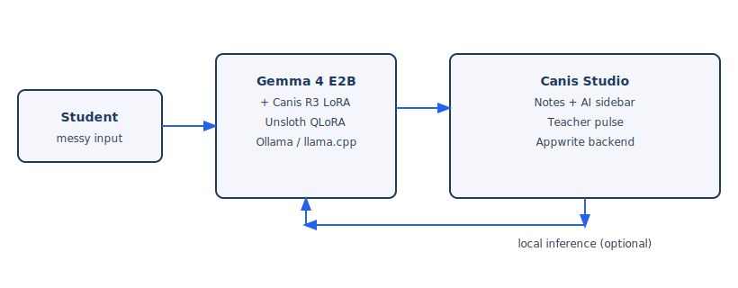

# Canis Teach — Giving Teachers the Classroom Back

**A Socratic, locally-running Gemma 4 tutor and an open classroom platform that puts the teacher back in charge of how AI is used in the room.**
|||
| --- | --- |
| 🎬 **Video** | https://www.youtube.com/watch?v=QbxPs0jLiZY |
| 🌐 **Live demo (Canis Studio)** | https://canis.appwrite.network |
| 🤗 **Dataset** | [CanisAI/teach-r3-multilingual](https://huggingface.co/datasets/CanisAI/teach-r3-multilingual) |
| 🤗 **Published adapter (51k multi-turn)** | [CanisAI/teach-multilingual-gemma-4-e2b-r3](https://huggingface.co/CanisAI/teach-multilingual-gemma-4-e2b-r3) |
| 📝 **Kaggle writeup** | [`WRITEUP.md`](WRITEUP.md) |

---

## TL;DR

Students open ChatGPT instead of asking the teacher. Canis replaces that habit with a **Gemma 4 E2B** tutor trained to teach—not answer—and delivers it through **Canis Studio**, with **llama.cpp** serving on a school PC.

- **Model:** `unsloth/gemma-4-E2B-unsloth-bnb-4bit` + [Canis R3 LoRA](https://huggingface.co/CanisAI/teach-multilingual-gemma-4-e2b-r3) (trained on **51,870** multi-turn dialogues)
- **Data:** Generated with **Gemma 4 26B** + [**Canis.lab**](data/generation/README.md) (see [`data/`](data/))
- **Deployment:** `llama-server` via [`cli/`](cli/) — local network, no student data to the cloud
- **Platform:** [`studio/`](studio/) — Canis Studio (React + Appwrite), live at https://canis.appwrite.network
- **Evidence (research, not R3/Studio pilots):** R1-era A/B study tools and aggregates in [`lesson/`](lesson/) — see [paper context](lesson/README.md#research-context)

There was **no classroom pilot of R3 or Canis Studio**. Register findings come from the **R1 research A/B** described in the Canis paper and [`lesson/`](lesson/).

---

## Try it now

1. **Hosted UI:** https://canis.appwrite.network → **Continue as Guest** → open the A1 demo worksheet.
2. **Local edge AI:** [`docs/ONBOARDING.md`](docs/ONBOARDING.md) — install llama.cpp, run `setup-canis-edge` + `run_edge`, allow **localhost** in browser/firewall ([`cli/EDGE_SETUP.md`](cli/EDGE_SETUP.md)), paste **`http://localhost:5000`** into the guest AI sidebar.

Example prompt:

> *hey kannst du mir einfach die lösung für aufgabe A1 schicken ich hab keine lust mehr*

A Socratic tutor should push back with a scaffolding question—not paste the answer. That behavior comes from the **TEACH pipeline** + your **Gemma 4 + R3 adapter** on **llama-server**, orchestrated by [`cli/`](cli/).

---

## How Gemma 4 is used

|||
| --- | --- |
| **Base model** | `unsloth/gemma-4-E2B-unsloth-bnb-4bit` |
| **Adaptation** | QLoRA via Unsloth |
| **LoRA rank / alpha** | r=16, alpha=16, dropout=0 |
| **Published adapter training set** | **51k multi-turn** [`teach-r3-multilingual`](https://huggingface.co/datasets/CanisAI/teach-r3-multilingual) (default config, `dialogue` field) |
| **Other training run** | Separate adapter from **161k** single-turn slice (not the published 51k model) |
| **Data generation** | **Gemma 4 26B A4B-IT** on DGX Spark (Ollama × NVIDIA GTC Golden Ticket) + **Canis.lab** seeds/workflows — [`data/generation/README.md`](data/generation/README.md) |
| **Training hardware** | RTX 4080 Super (too slow for full run) → rented **A6000**, ~12 h |
| **Published weights** | [`CanisAI/teach-multilingual-gemma-4-e2b-r3`](https://huggingface.co/CanisAI/teach-multilingual-gemma-4-e2b-r3) |
| **Local serving** | llama.cpp — [`cli/README.md`](cli/README.md), [`cli/EDGE_SETUP.md`](cli/EDGE_SETUP.md) |

**Gemma Terms of Use:** https://ai.google.dev/gemma/terms — see [`NOTICE`](NOTICE).

---

## Architecture

### End-to-end (Studio + edge CLI)

```text
Browser (Canis Studio @ canis.appwrite.network)
    → HTTP localhost:5000  (Canis API — TEACH pipeline)
    → HTTP localhost:8080  (llama-server — Gemma 4 + teach LoRA)
    → Socratic reply back to the AI sidebar
```



### Canis Studio (`studio/`)

React + Appwrite classroom pads, worksheets, guest demo, and AI sidebar. Guest mode loads read-only demo tables; teachers use full auth for real classes.

### Canis CLI (`cli/`)

- **:8080** — `llama-server` (GGUF base + LoRA)
- **:5000** — `python -m canis.interfaces.server` (loads `examples/TEACH.json`, applies adapter **`teach`**)

Onboarding: [`docs/ONBOARDING.md`](docs/ONBOARDING.md) · Edge setup: [`cli/EDGE_SETUP.md`](cli/EDGE_SETUP.md) (includes **browser/OS localhost permissions**).

### TEACH pipeline

Single R3 adapter — no math/science/language router. Flow diagram: [`assets/teach-pipeline.md`](assets/teach-pipeline.md).

---

## Security

This is a **public** submission repo. Do not commit Appwrite keys, project IDs, or `.env` files. See [`SECURITY.md`](SECURITY.md). The private Canis monorepo is not published here.

## Repository layout

```text
docs/ONBOARDING.md         ← start here (judges)
README.md / WRITEUP.md     ← submission narrative
cli/                       ← edge setup, TEACH pipeline, run_edge / setup-and-run
studio/                    ← Canis Studio (React + Appwrite)
training/                  ← Unsloth train.py + config
data/                      ← dataset docs, sample rows, Canis.lab generation note
lesson/                    ← R1 research evidence (markdown only; no PII)
model/                     ← HF load_adapter.py demo
assets/                    ← architecture diagram + teach-pipeline.md
LICENSE / NOTICE / CITATION.cff
```

---

## Reproduce

### Canis Studio (local)

```bash
cd studio
cp env.example .env   # set VITE_APPWRITE_* and VITE_CANISCLI_URL
npm install
npm run start
```

### Canis CLI + local model

```powershell
cd cli
copy canis_env.example.bat canis_env.bat
.\setup-and-run.ps1
```

See [`cli/EDGE_SETUP.md`](cli/EDGE_SETUP.md) and [`docs/ONBOARDING.md`](docs/ONBOARDING.md).

### Load adapter (Hugging Face)

```bash
pip install torch transformers peft accelerate
python model/load_adapter.py --prompt "bro idk what c is in this triangle thing"
```

### Re-run training (51k multi-turn)

```bash
cd training
pip install -r requirements.txt
mkdir -p runs/r3-51k && cp run_spec.hf_config.example.json runs/r3-51k/run_spec.json
# Edit runs/r3-51k/run_spec.json: remove max_samples for full train
python train.py --run-spec runs/r3-51k/run_spec.json
```

Details: [`training/README.md`](training/README.md).

---

## Evidence (research only)

| What | Where |
|------|--------|
| R1 research write-up (no raw PII) | [`lesson/`](lesson/) |
| Paper discussion (Hand & Brain, model comparison) | [`lesson/README.md`](lesson/README.md#research-context) |
| Aggregate register motivation (e.g. short student messages) | Paper + writeup — **not** an R3 or Studio field trial |

We are **not** shipping new eval benchmarks for this hackathon deadline. Training loss telemetry from the Unsloth Studio run was **not retained**; the adapter and config are published for reproduction.

---

## Limitations

- **No R3 or Canis Studio classroom pilot** — only prior **R1** research tooling (see `lesson/`).
- R3 training data is **synthetic** (Gemma 4 + Canis.lab), shaped by R1 register findings.
- Hosted Studio is a **demo deployment**, not a certified school product.
- Browser → local `llama-server` wiring is **operator setup** via `cli/`, not fully automated in Studio yet.
- Training charts were lost; re-run [`training/`](training/) for your own curves.

---

## Tracks

- **Future of Education** — Socratic local tutor + teacher-controlled platform story
- **Unsloth** — Gemma 4 E2B QLoRA; config in [`training/`](training/)
- **llama.cpp** — `llama-server` on a classroom PC via [`cli/`](cli/)

---

## Acknowledgments

Google DeepMind (Gemma 4), Unsloth, llama.cpp, Ollama & NVIDIA (GTC Golden Ticket / DGX Spark for R3 generation), Appwrite (Studio hosting), teachers and students in the **R1 research study** (see paper).

---

## Citation

```bibtex
@software{canis_teach_2026,
  title  = {Canis Teach: Giving Teachers the Classroom Back},
  author = {Nedilko, Marko},
  year   = {2026},
  url    = {https://github.com/crasyK/canis-gemma4good}
}
```

See [`CITATION.cff`](CITATION.cff).

---

## License

- **Source code:** [Apache-2.0](LICENSE)
- **Writeup / video script:** CC BY 4.0 where noted for Kaggle submission
- **Gemma weights:** [Gemma Terms of Use](https://ai.google.dev/gemma/terms) — [`NOTICE`](NOTICE)
