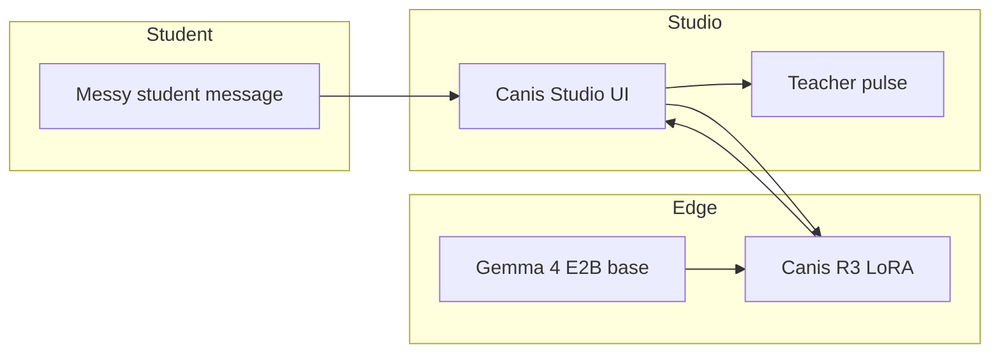

# Media assets

Add these before final Kaggle submission:

| File | Purpose |
|------|---------|
| [`cover.png`](cover.png) | **Required** Kaggle writeup cover (16:9 or 2:1 recommended) |
| [`architecture.png`](architecture.png) | Gemma 4 + LoRA + Canis Studio diagram |
| [`screenshots/`](screenshots/) | Studio UI, hot-swap, tutor dialog |

## Generating `architecture.png`

Source diagram (Mermaid) — export via [mermaid.live](https://mermaid.live) or your editor:

