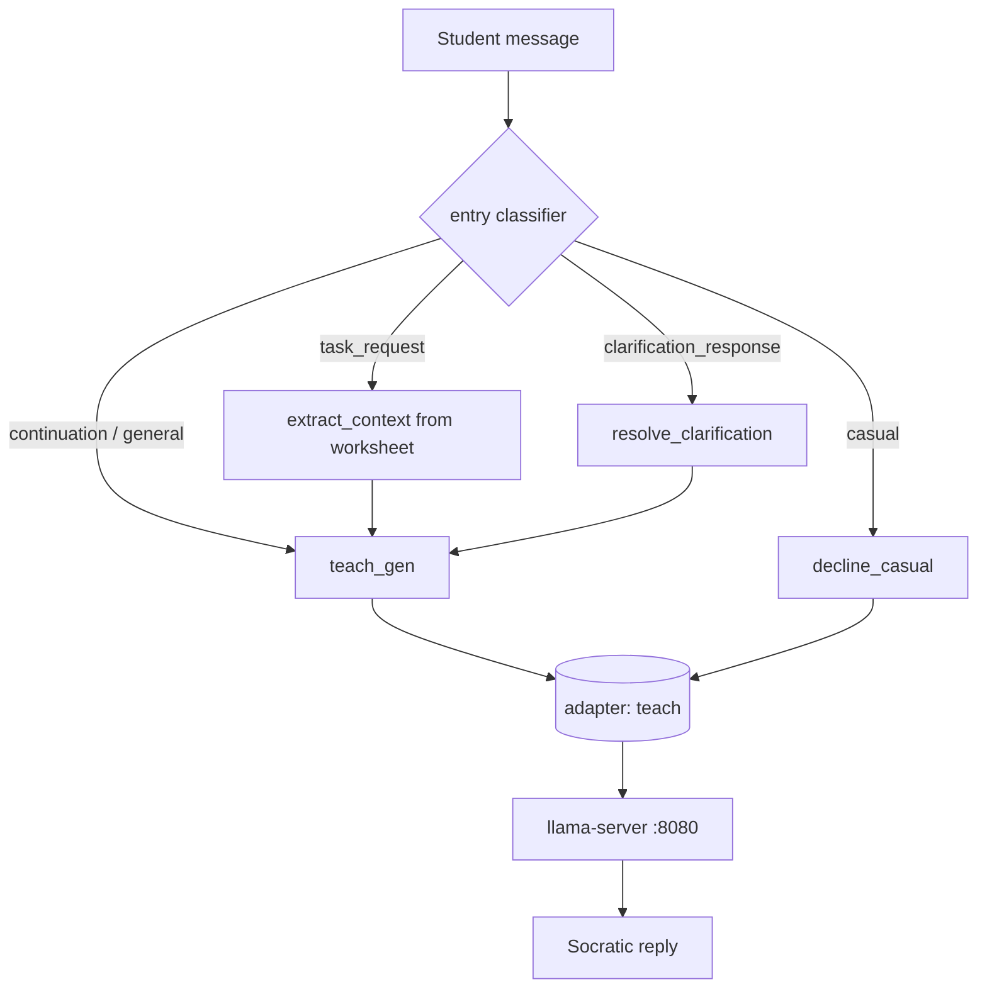

# TEACH pipeline (reference)

The **TEACH** pipeline orchestrates tutoring without per-subject LoRA routers. Every tutoring turn uses the single R3 adapter registered as **`teach`**.

**Setup contract:** after `sync_canis_models_to_llama.ps1`, the LoRA file must exist at:

`canis-models/lora/teach/teach.gguf`

The Canis API applies `CANIS_TEACH_ADAPTER=teach` on startup. Pipeline definition: [`cli/examples/TEACH.json`](../cli/examples/TEACH.json).
